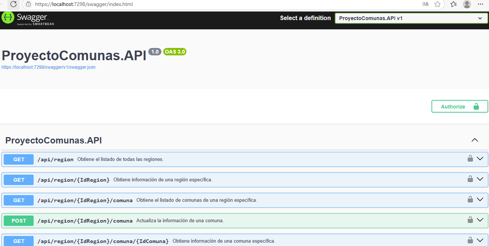
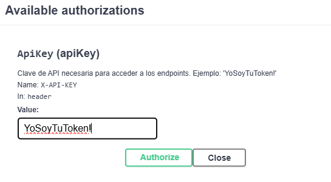
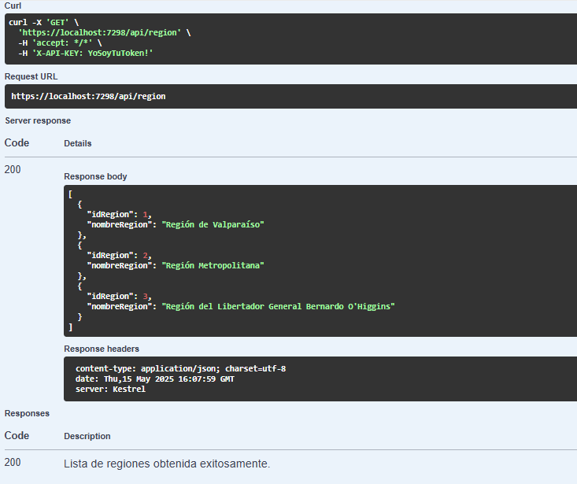

# Proyecto Comunas de Chile

Este es un proyecto simple desarrollado en **.NET 8** que permite consultar las regiones y comunas de Chile. Además, incluye la funcionalidad para editar las comunas. El proyecto está dividido en tres capas principales: **Datos**, **API** y **Web**.

## Estructura del Proyecto

### 1. **Datos**
Biblioteca de clases para la conexión a una base de datos **SQL Server**. Este proyecto se encarga de consumir procedimientos almacenados para realizar las operaciones necesarias.  
**Estado actual:**
- Aún no se ha creado la base de datos, por lo que no se cuenta con un `connectionString`.
- Se utilizan datos de prueba en la API para validar el funcionamiento.

### 2. **API**
Servicio **REST API** que utiliza el proyecto **Datos** para exponer los resultados en formato **JSON**.  
**Características:**
- Implementa un **Token fijo** para la autenticación básica.
- Incluye registro de logs para monitorear las operaciones.

### 3. **Web**
Capa de presentación desarrollada en **ASP.NET Core Razor Pages**, con una estructura y diseño similar a **.NET Core 3.1**.  
**Estado actual:**
- Consume los servicios REST de la API.
- No se ha implementado seguridad en esta capa.
- Próximamente se migrará a un diseño más moderno aprovechando las características de **.NET 8**.

## Scripts de Base de Datos
Los scripts necesarios para crear la base de datos y los procedimientos almacenados se encuentran en la carpeta `T-SQL`.

## Tecnologías Utilizadas
- **.NET 8** para todos los proyectos.
- **SQL Server** como base de datos (pendiente de implementación).
- **NLog** para el registro de logs en los proyectos **API** y **Datos**.

## Notas Importantes
- Este proyecto fue desarrollado con el apoyo de **GitHub Copilot** para garantizar buenas prácticas de programación.
- Actualmente, no se cuenta con una base de datos funcional para probar los servicios del API con procedimientos almacenados.

## Próximos Pasos
1. Crear la base de datos y configurar el `connectionString` en el proyecto **Datos**.
2. Implementar seguridad en la capa **Web**.
3. Migrar la capa de presentación a un diseño más moderno utilizando las características avanzadas de **.NET 8**.
4. Optimizar el código y aplicar buenas prácticas en todo el proyecto.

## Cómo Ejecutar el Proyecto
1. Clonar este repositorio.
2. Configurar el entorno de desarrollo con **Visual Studio 2022**.
3. Ejecutar los proyectos en el siguiente orden:
   - **Datos**: Configurar la conexión a la base de datos.
   - **API**: Iniciar el servicio REST.
   - **Web**: Ejecutar la capa de presentación.

---

## 🧪 API - Pruebas con Swagger (OpenAPI)

Este proyecto incluye documentación interactiva de la API mediante **Swagger (OpenAPI)**. Puedes usar esta interfaz para:

- Ver todos los endpoints disponibles
- Probar directamente las consultas desde el navegador
- Agregar autenticación con un token para acceder a los métodos protegidos

### 🔐 Token para pruebas

Para consumir los endpoints protegidos, debes ingresar el siguiente token en Swagger UI:

```
YoSoyTuToken!
```

Haz clic en el botón **Authorize** (candado), pega el token y luego realiza tus pruebas.

### 📸 Capturas de Swagger UI

- **📋 Endpoints disponibles:**

  

- **🔑 Ingreso del Token:**

  

- **🌍 Consumo del endpoint de regiones:**

  

---

¡Gracias por revisar este proyecto! Si tienes sugerencias o mejoras, no dudes en contribuir.
